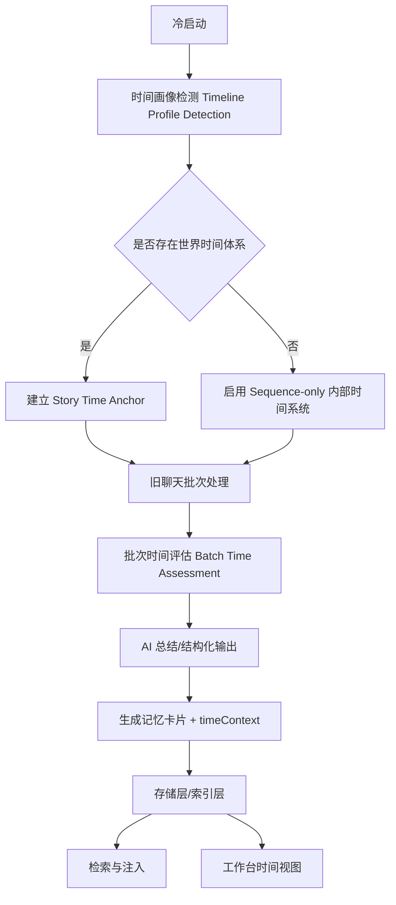

# 时间系统实施方案（主链路 / 冷启动 / AI 总结 / 旧聊天接管 / 工作台）

> 目标：为记忆系统补上一套**统一时间画像与时序治理能力**，让所有记忆都带有可解释、可排序、可注入、可检索的时间信息；并能自然融入**冷启动、旧聊天处理、AI 总结、注入与检索、工作台诊断**全链路。  
> 本方案强调：**不伪造精确日期、不把时间塞进主身份键、永远保留系统时序兜底**。

---

## 1. 背景与目标

当前记忆系统通常能抽取“发生了什么”“谁和谁是什么关系”“有哪些稳定事实”，但在以下场景会失真：

1. 有些记忆来自旧聊天早期，有些来自最近几层，但系统缺少统一的“早晚”标识。
2. 故事内有明确时间（如“次日清晨”“三天后”“永和十二年冬”）时，没有稳定承接到记忆卡片。
3. AI 总结时只抽事实，不先评估“这一批内容经历了多久”，导致注入时缺少时间感。
4. 冷启动时若世界没有明示时间设定，系统无法建立统一的时序规则。
5. 工作台只能看内容，不能看“这条记忆是什么时候”“为什么被判定成这个时间”。

### 1.1 方案目标

本次时间系统需要一次性满足以下能力：

- **所有记忆都带时间信息**，哪怕没有明确世界时间，也要带系统时序时间。
- **支持世界时间与系统时序双时间轴**。
- **接入冷启动**：自动检测世界是否有时间设定，无则启用内部时间系统。
- **接入旧聊天处理**：每个批次先评估时间，再落到每条记忆。
- **接入 AI 总结**：输出结构化时间评估结果，并参与最终记忆卡片生成。
- **接入注入与检索**：时间作为排序、解释、权重、过滤维度。
- **接入工作台**：可查看、排序、过滤、诊断时间来源与置信度。
- **向后兼容旧记忆**：允许无时间老数据迁移到新系统。

### 1.2 非目标

本期不追求：

- 构建一个绝对精确的故事历法引擎。
- 对所有文本都生成“准确到年月日时分秒”的时间。
- 用时间替代内容抽取与实体对齐。
- 把时间当作主 compareKey，导致同一事实按时间裂变。

---

## 2. 核心设计原则

### 2.1 双时间轴：世界时间 + 系统时序

每条记忆同时支持两套时间：

#### A. 世界时间（Story Time）
故事内显式或可推断的时间，如：

- `2024年10月12日夜`
- `次日清晨`
- `三天后`
- `永和十二年冬`
- `开学后第三周`

#### B. 系统时序（Sequence Time）
无论是否识别到世界时间，系统都必须能表达这条记忆的先后位置：

- 来自第几层到第几层
- 属于第几批旧聊天总结
- 比当前早多少层 / 多少批
- 在时间线上相对于其他记忆更早还是更近

> 结论：**世界时间是增强项，系统时序是保底项。**

---

### 2.2 先评估批次时间，再评估单条记忆时间

时间不是最后在卡片上补一个字符串。  
正确链路应为：

1. 先识别**聊天级时间画像**。
2. 再对每个旧聊天批次 / 总结批次做**批次时间评估**。
3. 最后将评估结果映射到每条记忆的 `timeContext`。

这样做的好处：

- 批次中的多条记忆共享相同上下文，时间判断更稳定。
- 能先得到“这一批内容大概过了多久”，再给单条记忆分配时间。
- 避免单条记忆脱离上下文误判时间。

---

### 2.3 时间不进入主身份键

**禁止**将时间直接写入事实主身份 compareKey。  
否则会出现：

- “何盈是老岫村人（第 10 层）”
- “何盈是老岫村人（第 35 层）”
- “何盈是老岫村人（次日清晨）”

被系统误认为三条不同事实。

#### 正确做法

- 时间是**附加维度**
- 时间是**排序维度**
- 时间是**有效期维度**
- 时间是**解释维度**

而不是主身份维度。

---

### 2.4 不伪造精确日期

如果文本里没有给出精确故事时间，系统不要硬编：

- 不要把“后来”强行翻成 `2025-01-01`
- 不要把“场景切换”强行翻成“隔天”

正确行为应为：

- 能识别显式时间时，用显式时间
- 能识别相对时间时，用相对时间
- 都识别不到时，用系统时序 + 粗粒度时长兜底

---

### 2.5 时间规则必须事件驱动，而不是固定换算

不建议使用“1 层 = 1 小时”“1 批 = 1 天”这种硬编码规则。  
建议采用**事件驱动的时间推进策略**：

- 同场景连续对话：几乎不推进
- 明显场景切换：推进一个场景单位或少量小时
- 睡觉 / 醒来 / 天亮：推进数小时
- 明示“次日 / 三天后”：显式时间直接覆盖兜底规则

---

## 3. 总体架构

### 3.1 新增时间子系统

建议引入一组独立但贯穿全链路的模块：

```text
memory-time/
├─ timeline-profile.ts         # 聊天级时间画像
├─ time-context.ts             # 记忆级时间上下文
├─ batch-time-assessment.ts    # 批次时间评估
├─ fallback-time-engine.ts     # 时间兜底规则引擎
├─ story-time-parser.ts        # 显式/相对时间解析
├─ sequence-time.ts            # 楼层/批次/顺序时序生成
├─ time-ranking.ts             # 检索和注入时的时间加权
├─ time-format.ts              # 工作台展示格式化
└─ time-debug.ts               # 调试日志与可视化辅助
```

> 如果你当前仓库没有这套目录，也建议按这个层级拆分；至少要让“解析、规则、存储、展示”分离。

---

### 3.2 主链路接入图



---

## 4. 数据模型设计

### 4.1 聊天级时间画像：`MemoryTimelineProfile`

用于描述整个聊天世界目前采用什么时间体系、基准锚点是什么、兜底规则是什么。

```ts
export type MemoryTimelineProfile = {
  profileId: string;

  /**
   * explicit_world_time:
   *   文本中存在明确世界时间体系，如公历、古代年号、学期制、奇幻纪年
   * implicit_world_time:
   *   没有稳定历法，但有明确的“次日/当夜/三天后/清晨/黄昏”等时间推进语义
   * sequence_only:
   *   基本无法识别世界时间，使用系统时序作为主时间轴
   */
  mode: 'explicit_world_time' | 'implicit_world_time' | 'sequence_only';

  /**
   * 历法类型
   */
  calendarKind: 'gregorian' | 'lunar' | 'ancient_era' | 'fantasy_custom' | 'academic_term' | 'floating' | 'unknown';

  /**
   * 当前已知时间锚点来自哪一层
   */
  anchorFloor: number;

  /**
   * 时间锚点原始文本，如“永和十二年冬”“2024年10月12日夜”
   */
  anchorTimeText?: string;

  /**
   * 可选的归一化时间
   */
  anchorNormalized?: {
    year?: number;
    month?: number;
    day?: number;
    hour?: number;
    season?: string;
    partOfDay?: 'dawn' | 'morning' | 'noon' | 'afternoon' | 'evening' | 'night' | 'midnight';
  };

  /**
   * 当前画像置信度
   */
  confidence: number;

  /**
   * 当无法识别精确故事时间时的兜底推进规则
   */
  fallbackRules: {
    sameSceneAdvance: { value: number; unit: 'minute' | 'hour' | 'scene' };
    sceneBreakAdvance: { value: number; unit: 'hour' | 'day' | 'scene' };
    sleepAdvance: { value: number; unit: 'hour' };
    hardCutAdvance: { value: number; unit: 'day' };
  };

  /**
   * 识别依据，供工作台与日志查看
   */
  signals?: Array<{
    text: string;
    sourceFloor?: number;
    kind: 'explicit_date' | 'relative_time' | 'calendar_hint' | 'scene_transition' | 'schedule_hint';
    confidence: number;
  }>;

  /**
   * 版本控制
   */
  version: number;
  updatedAt: number;
};
```

### 设计说明

- `mode` 决定整个聊天以哪种方式理解时间。
- `calendarKind` 用来指示是现代、公历、古风、奇幻还是模糊时间。
- `fallbackRules` 是最关键的兜底策略，后续批次没有明显时间时就按这个规则推进。
- `signals` 供工作台展示“为什么系统这么判断”。

---

### 4.2 批次级时间评估：`BatchTimeAssessment`

用于旧聊天接管、历史总结、分批抽取等过程。  
它是时间系统的中间态，也是 AI 总结阶段必须先产出的结果。

```ts
export type BatchTimeAssessment = {
  batchId: string;

  /**
   * 该批次覆盖的楼层范围
   */
  floorRange: {
    startFloor: number;
    endFloor: number;
  };

  /**
   * 批次中识别到的显式时间表达
   */
  explicitMentions: string[];

  /**
   * 批次开始时间锚点（原文）
   */
  anchorBefore?: string;

  /**
   * 批次结束时间锚点（原文）
   */
  anchorAfter?: string;

  /**
   * 该批次整体经历了多久
   */
  inferredElapsed?: {
    text: string; // 例如 “约过了一夜”“大概三天”
    amount?: number;
    unit?: 'minute' | 'hour' | 'day' | 'month' | 'year' | 'scene' | 'turn';
    confidence: number;
  };

  /**
   * 该批次中观察到的重要场景切换
   */
  sceneTransitions: string[];

  /**
   * 是否建议启用纯兜底规则
   */
  fallbackRecommended: boolean;

  /**
   * 采用了哪种判断来源
   */
  source: 'model' | 'rule_engine' | 'hybrid';

  /**
   * 综合置信度
   */
  confidence: number;
};
```

### 设计说明

- 旧聊天处理时，不先出 `BatchTimeAssessment`，后面单条卡片会非常散。
- 这是连接“批次上下文”和“单条记忆时间”的桥梁。

---

### 4.3 记忆级时间上下文：`MemoryTimeContext`

每条记忆统一挂载的时间对象。

```ts
export type MemoryTimeContext = {
  /**
   * story_explicit:
   *   有明确故事时间
   * story_inferred:
   *   有推断得到的故事时间
   * sequence_fallback:
   *   没有故事时间，仅保留系统时序
   */
  mode: 'story_explicit' | 'story_inferred' | 'sequence_fallback';

  /**
   * 故事时间
   */
  storyTime?: {
    calendarKind?: 'gregorian' | 'lunar' | 'ancient_era' | 'fantasy_custom' | 'academic_term' | 'floating' | 'unknown';

    /**
     * 原始绝对时间文本
     * 如：2024年10月12日夜里 / 永和十二年冬
     */
    absoluteText?: string;

    /**
     * 原始相对时间文本
     * 如：次日清晨 / 三天后 / 当夜
     */
    relativeText?: string;

    /**
     * 归一化时间（能归一就归一，不能归一可以留空）
     */
    normalized?: {
      year?: number;
      month?: number;
      day?: number;
      hour?: number;
      minute?: number;
      season?: string;
      partOfDay?: 'dawn' | 'morning' | 'noon' | 'afternoon' | 'evening' | 'night' | 'midnight';
    };
  };

  /**
   * 系统时序保底
   * 注意：这个字段必须始终存在
   */
  sequenceTime: {
    firstFloor: number;
    lastFloor: number;
    batchId?: string;
    orderIndex: number;
  };

  /**
   * 与上一时间锚点相比，推断过去了多久
   */
  durationHint?: {
    text?: string;
    amount?: number;
    unit?: 'minute' | 'hour' | 'day' | 'month' | 'year' | 'scene' | 'turn';
    confidence: number;
  };

  /**
   * 来源：冷启动、旧聊天总结、普通总结、兜底引擎、人工修正
   */
  source: 'cold_start' | 'takeover_batch' | 'summary_batch' | 'fallback_engine' | 'manual';

  /**
   * 置信度
   */
  confidence: number;
};
```

### 强约束

- `sequenceTime` **必须存在**
- `storyTime` 可选
- 不允许只存 `timeText` 而没有结构化字段

---

### 4.4 按记忆类型的扩展时间字段

不同类型的记忆，时间表达应不同。

#### A. 稳定事实类（identity / stable fact）

```ts
type StableFactTimeMeta = {
  firstObservedAt: MemoryTimeContext;
  lastObservedAt: MemoryTimeContext;
  isStable: boolean;
};
```

适用于：

- 人物身份
- 出身
- 常识型世界规则
- 持久偏好

#### B. 事件类（event）

```ts
type EventTimeMeta = {
  eventTime: MemoryTimeContext;
  floorRange: { startFloor: number; endFloor: number };
  elapsedFromPrevious?: MemoryTimeContext['durationHint'];
};
```

适用于：

- 某次相遇
- 某次冲突
- 某个动作发生

#### C. 关系类 / 状态类（relation / world_state）

```ts
type IntervalTimeMeta = {
  validFrom: MemoryTimeContext;
  validTo?: MemoryTimeContext;
  ongoing: boolean;
};
```

适用于：

- 关系变化
- 情感阶段
- 世界状态
- 持续进行中的情境

---

## 5. 冷启动接入方案

### 5.1 冷启动阶段新增：时间画像检测

冷启动除了做世界画像、角色画像、上下文初始化，还要新增一步：

### `Timeline Profile Detection`

输入：

- 最近若干层原始聊天
- 已有总结
- 世界设定文本
- 系统卡片 / 世界书 / lorebook 中的时间设定
- 已存记忆中的时间线索

输出：

- `MemoryTimelineProfile`

---

### 5.2 冷启动检测策略

#### 第一层：显式时间体系识别

优先识别以下模式：

##### 现代公历 / 常规日期
- `2024年10月12日`
- `10月12日晚`
- `星期一`
- `凌晨三点`

##### 古代纪年 / 年号
- `永和十二年`
- `景泰三年冬`
- `甲子年`
- `腊月初七`

##### 学期制 / 学校时间
- `开学后第三周`
- `期中周`
- `暑假结束后`
- `大一下学期`

##### 奇幻纪年
- `帝国历 472 年`
- `第七纪冬末`
- `星火历`

#### 第二层：隐式时间体系识别

如果没有稳定历法，识别相对时间推进语义：

- `次日`
- `当夜`
- `第二天一早`
- `三天后`
- `半年后`
- `清晨`
- `黄昏`
- `深夜`

#### 第三层：无时间体系

如果两者都很弱，则进入：

- `mode = sequence_only`

---

### 5.3 冷启动初始化结果

#### 情况 A：存在明确世界时间体系

- 建立 `anchorTimeText`
- 尝试归一化到 `anchorNormalized`
- 根据文本特征初始化 `calendarKind`
- 后续批次优先沿这个锚点推进

#### 情况 B：只有模糊时间推进

- `mode = implicit_world_time`
- 使用“场景 + 相对时间”的规则推进

#### 情况 C：完全没有时间设定

- `mode = sequence_only`
- 启用内部时序系统
- 不生成虚假的年月日，只保留先后顺序和粗略经过时长

---

### 5.4 冷启动默认兜底规则建议

```ts
const defaultFallbackRules = {
  sameSceneAdvance: { value: 0, unit: 'scene' },
  sceneBreakAdvance: { value: 1, unit: 'scene' },
  sleepAdvance: { value: 8, unit: 'hour' },
  hardCutAdvance: { value: 1, unit: 'day' },
};
```

### 说明

- 同一场景内，默认不推进精确时间，只保持“同场景”
- 明显切换场景推进一个场景单位
- 睡觉 / 天亮推进数小时
- 长跳转 / 硬切默认推进一天

---

## 6. 旧聊天处理接入方案

### 6.1 批次处理前先做时间评估

旧聊天接管通常已经按楼层分片 / 按批次总结。  
在每个批次进入抽取前，增加一个子阶段：

### `Batch Time Assessment`

处理顺序建议改为：

```text
旧聊天分批
-> 读取 Timeline Profile
-> 批次时间评估
-> AI 总结该批次
-> 生成记忆卡片
-> 给每条记忆挂 timeContext
-> 入库
```

---

### 6.2 旧聊天批次输入建议

每个批次向模型或规则引擎提供：

- 批次楼层范围
- 批次原始文本
- 上一批的时间锚点
- 当前 `timelineProfile`
- 当前批次前后的场景边界提示

这样模型才能判断：

- 这批内容是同一天内
- 还是隔了一夜
- 还是“几天后”
- 还是完全看不出来，只能按系统时序处理

---

### 6.3 批次时间评估输出要求

建议将旧聊天处理结构化输出增加一节：

```json
{
  "batchTimeAssessment": {
    "explicitMentions": ["次日清晨", "当夜"],
    "anchorBefore": "守灵当夜",
    "anchorAfter": "次日清晨",
    "inferredElapsed": {
      "text": "约过了一夜",
      "amount": 8,
      "unit": "hour",
      "confidence": 0.82
    },
    "sceneTransitions": [
      "从灵堂切到村口",
      "从深夜切到清晨"
    ],
    "fallbackRecommended": false,
    "source": "hybrid",
    "confidence": 0.81
  }
}
```

---

### 6.4 旧聊天批次中的卡片映射规则

#### 规则 1：如果批次有明确 anchorAfter / anchorBefore

优先将其作为本批事件类记忆的 `storyTime`

#### 规则 2：如果只有 `inferredElapsed`

则记忆 `mode = story_inferred`

#### 规则 3：如果既无明确时间也无可靠时长

则所有记忆使用：

- `mode = sequence_fallback`
- `sequenceTime` 写入楼层范围与顺序信息

---

## 7. AI 总结接入方案

### 7.1 总结链路新增“时间先行”步骤

无论是旧聊天处理还是日常增量总结，都建议在总结提示词中明确要求：

> 先判断本批内容是否出现了时间锚点、时间推进、场景切换、昼夜变化、休息/睡眠、季节变化；  
> 再给出本批整体经历时长；  
> 最后生成记忆卡片并附上时间上下文。

---

### 7.2 提示词约束建议

在总结 Prompt 中新增一段时间规则说明：

```md
你需要在生成记忆前，先判断本批内容的时间信息：

1. 提取显式时间表达：
   - 绝对时间：如“2024年10月12日夜”“永和十二年冬”
   - 相对时间：如“次日”“当夜”“三天后”“清晨”

2. 判断这一批整体经历了多久：
   - 若文本明确提到，直接使用
   - 若可根据睡觉、天亮、场景切换推断，则给出推断
   - 若无法判断，不要编造精确日期

3. 所有记忆都必须输出 timeContext：
   - 有明确故事时间：story_explicit
   - 有推断故事时间：story_inferred
   - 无法识别时间：sequence_fallback
```

---

### 7.3 结构化输出 Schema 增补建议

现有总结 schema 中增加：

```ts
type SummaryOutput = {
  batchTimeAssessment: BatchTimeAssessment;
  memories: Array<{
    // 原有字段...
    timeContext: MemoryTimeContext;
  }>;
};
```

---

### 7.4 单条记忆时间分配策略

#### 稳定事实类
不要求精确事件时刻，建议写：

- `firstObservedAt`
- `lastObservedAt`

#### 事件类
优先继承：

- 批次 `anchorAfter`
- 或批次 `inferredElapsed`

#### 关系变化 / 状态变化类
优先使用：

- `validFrom`
- `validTo`
- `ongoing`

---

## 8. 时间兜底引擎设计

### 8.1 规则优先级

建议按以下优先级执行：

1. **显式绝对时间**
2. **显式相对时间**
3. **可识别事件推进信号**
4. **聊天级 fallbackRules**
5. **纯系统时序**

---

### 8.2 显式时间模式举例

#### 绝对时间
- `2024年10月12日夜`
- `永和十二年冬`
- `帝国历472年`

#### 相对时间
- `次日`
- `三天后`
- `半个月后`
- `当夜`
- `午后`
- `黄昏`

---

### 8.3 事件推进信号举例

#### 同场景连续对话
- “继续说”
- “沉默片刻”
- “对视了一会儿”
- “接着”

推进建议：
- 不推进或极小推进

#### 场景切换
- “回到屋里”
- “到了村口”
- “转场到教室”
- “镜头切到”

推进建议：
- `+1 scene` 或 `+1~3 小时`

#### 休息 / 睡眠 / 天亮
- “睡了一觉”
- “醒来”
- “天亮了”
- “次日清晨”

推进建议：
- `+6~8 小时` 或直接采用显式时间

#### 长跳转
- “几天后”
- “过了一个月”
- “暑假结束后”

推进建议：
- 按文本显式表达推进

---

### 8.4 兜底算法伪代码

```ts
function resolveBatchTime(
  batchText: string,
  previousAnchor: MemoryTimelineProfile | null,
  rules: MemoryTimelineProfile['fallbackRules']
): BatchTimeAssessment {
  const explicit = parseExplicitTimeMentions(batchText);
  if (explicit.absolute || explicit.relative) {
    return buildAssessmentFromExplicit(explicit);
  }

  const sceneSignals = detectSceneTransitions(batchText);
  const sleepSignals = detectSleepAndWake(batchText);
  const hardCutSignals = detectHardCuts(batchText);

  const inferred = inferElapsedFromSignals({
    sceneSignals,
    sleepSignals,
    hardCutSignals,
    rules,
  });

  if (inferred) {
    return {
      batchId: '',
      floorRange: { startFloor: 0, endFloor: 0 },
      explicitMentions: [],
      inferredElapsed: inferred,
      sceneTransitions: sceneSignals,
      fallbackRecommended: false,
      source: 'hybrid',
      confidence: inferred.confidence,
    };
  }

  return {
    batchId: '',
    floorRange: { startFloor: 0, endFloor: 0 },
    explicitMentions: [],
    sceneTransitions: [],
    fallbackRecommended: true,
    source: 'rule_engine',
    confidence: 0.45,
  };
}
```

---

## 9. 存储层与索引层改造

### 9.1 Memory 实体扩展

在现有记忆实体上追加：

```ts
type MemoryRecord = {
  id: string;
  type: string;
  content: string;

  // 新增
  timeContext: MemoryTimeContext;

  // 按类型可选
  firstObservedAt?: MemoryTimeContext;
  lastObservedAt?: MemoryTimeContext;
  validFrom?: MemoryTimeContext;
  validTo?: MemoryTimeContext;
  ongoing?: boolean;
};
```

---

### 9.2 索引建议

#### 必建索引维度

- `sequenceTime.firstFloor`
- `sequenceTime.lastFloor`
- `sequenceTime.orderIndex`
- `timeContext.mode`
- `timeContext.storyTime.normalized.year/month/day`（如有）
- `source`
- `confidence`

#### 检索辅助字段

可考虑新增扁平字段，便于搜索与 UI：

```ts
type MemoryTimeIndex = {
  sortEpoch?: number;        // 可归一时生成
  sequenceOrder: number;     // 必有
  recencyBucket: 'recent' | 'mid' | 'old';
  timeLabel: string;         // “次日清晨 / 约三天后 / 早于当前约18层”
};
```

> 注意：`sortEpoch` 只有在能归一化到相对可靠的时间时才生成，不能瞎填。

---

### 9.3 向后兼容

旧记忆没有 `timeContext` 时：

- 迁移脚本补 `sequence_fallback`
- 以创建顺序 / 首次出现楼层 / 摘要批次顺序构造 `sequenceTime`
- `confidence` 置低
- `source = fallback_engine`

---

## 10. 检索与注入接入方案

### 10.1 注入文案格式建议

时间注入不要只显示单一时间字符串，建议三档表达：

#### A. 明确故事时间
- `时间：次日清晨`
- `时间：永和十二年冬夜`

#### B. 推断故事时间
- `时间：疑似三天后`
- `时间：约在守灵当夜之后`

#### C. 仅系统时序
- `时序：较当前早约 18 层`
- `时序：属于更早一批旧聊天内容`

---

### 10.2 注入格式示例

```md
- [事件记忆]
  内容：{{user}} 在灵堂见到了何盈。
  时间：守灵当夜
  时序：来自第 120-126 层
  置信度：0.84

- [关系记忆]
  内容：{{user}} 与何盈是旧识，关系在守灵事件后显著变化。
  时间：约在守灵当夜之后
  时序：较当前早约 1 批
  置信度：0.72
```

---

### 10.3 时间敏感检索

检索阶段建议增加时间相关 rerank：

#### 查询偏近期
当用户问：

- 现在
- 最近
- 刚才
- 目前
- 最新

则提高：

- `sequenceTime` 更靠后的记忆
- `validTo` 为空且 `ongoing = true` 的状态类记忆

#### 查询偏远期 / 早期
当用户问：

- 以前
- 小时候
- 最早
- 当年
- 刚认识那会儿

则提高：

- `firstObservedAt` 更早的记忆
- `sequenceTime` 更靠前的记忆

---

### 10.4 时间检索分计算建议

```ts
function computeTimeBoost(query: string, memory: MemoryRecord): number {
  if (isRecentQuery(query)) {
    return boostRecent(memory);
  }
  if (isEarlyQuery(query)) {
    return boostEarly(memory);
  }
  return 0;
}
```

最终分数建议：

```ts
finalScore =
  semanticScore * 0.72 +
  structuralScore * 0.13 +
  timeScore * 0.15;
```

> 具体权重可调，但建议先让时间成为辅助因子，而不是主导因子。

---

## 11. 工作台接入方案

### 11.1 记忆卡片增加时间显示区

每条记忆卡片新增：

- 时间模式：`story_explicit / story_inferred / sequence_fallback`
- 时间标签：`次日清晨 / 约过了一夜 / 较当前早约18层`
- 时间来源：`summary_batch / takeover_batch / fallback_engine`
- 置信度

---

### 11.2 新增时间筛选与排序

#### 筛选项
- 只看有明确故事时间
- 只看推断时间
- 只看系统时序兜底
- 只看低置信度时间
- 只看持续状态类记忆

#### 排序项
- 按最早
- 按最近
- 按楼层顺序
- 按时间置信度
- 按批次顺序

---

### 11.3 新增“批次时间评估”面板

在旧聊天处理 / 总结详情中增加一个面板，显示：

- 楼层范围
- 本批显式时间表达
- 推断经过时长
- 场景切换列表
- 采用的时间模式
- 置信度
- 是否进入兜底规则

#### 示例展示

```md
批次：BATCH-014
楼层：120 - 147
时间模式：story_inferred
识别到的时间表达：当夜、次日清晨
推断经过时长：约 8 小时
场景切换：灵堂 -> 村口 -> 屋内
来源：hybrid
置信度：0.81
```

---

### 11.4 新增时间画像总览

聊天级工作台顶部增加一个总览卡：

- 当前时间模式：`explicit_world_time / implicit_world_time / sequence_only`
- 历法类型
- 当前时间锚点
- 默认兜底规则
- 最近一次更新时间
- 检测依据（signals）

---

### 11.5 新增诊断能力

建议增加：

- `为什么这条记忆被判断为次日清晨？`
- `为什么这一批被判定为约过了一夜？`
- `为什么这条记忆只有 sequence_fallback？`

工作台可展开显示：

- 命中的时间表达
- 使用的兜底规则
- 参与判断的上一锚点
- 规则引擎与模型判断的差异

---

## 12. 提示词与 Schema 变更建议

### 12.1 冷启动 Prompt 增补

新增任务：

- 识别是否存在稳定时间体系
- 提取时间锚点
- 判断时间模式
- 输出 `timelineProfile`

---

### 12.2 旧聊天接管 Prompt 增补

新增要求：

1. 先总结本批内容整体经历了多久
2. 抽取显式时间表达
3. 判断是否需要 fallback
4. 再输出记忆

---

### 12.3 日常总结 Prompt 增补

新增要求：

1. 所有记忆必须带 `timeContext`
2. 没有故事时间时必须带 `sequenceTime`
3. 不允许凭空编造精确日期

---

### 12.4 结构化校验建议

增加校验规则：

- `timeContext` 必填
- `sequenceTime` 必填
- `mode = story_explicit` 时，`storyTime.absoluteText || storyTime.relativeText` 至少其一存在
- `mode = sequence_fallback` 时，`storyTime` 可以为空
- `confidence` 必须存在

---

## 13. 迁移与回填方案

### 13.1 老数据迁移步骤

#### Phase 1：结构迁移
为所有现有记忆增加空的时间字段结构。

#### Phase 2：顺序回填
根据历史楼层 / 创建顺序 / 批次顺序写入 `sequenceTime`。

#### Phase 3：高价值记忆补时间
对以下高价值对象做二次重跑：

- 事件类记忆
- 持续状态类记忆
- 高频注入记忆
- 近期活跃角色相关记忆

#### Phase 4：工作台显示兼容
对无完整时间信息的旧卡片显示：

- `时间：未识别`
- `时序：基于历史顺序补全`

---

### 13.2 迁移脚本伪代码

```ts
for (const memory of allMemories) {
  if (!memory.timeContext) {
    memory.timeContext = {
      mode: 'sequence_fallback',
      sequenceTime: {
        firstFloor: memory.firstFloor ?? 0,
        lastFloor: memory.lastFloor ?? memory.firstFloor ?? 0,
        batchId: memory.batchId,
        orderIndex: memory.createdOrder ?? 0,
      },
      source: 'fallback_engine',
      confidence: 0.35,
    };
  }
}
```

---

## 14. 实施步骤建议

### Phase A：打基础（必须先做）
1. 新增时间数据模型：
   - `MemoryTimelineProfile`
   - `BatchTimeAssessment`
   - `MemoryTimeContext`

2. 存储层允许记忆写入 `timeContext`

3. 给所有新记忆强制补 `sequenceTime`

---

### Phase B：接入冷启动
1. 冷启动增加 `timeline profile detection`
2. 将结果写入聊天级状态
3. 允许从世界设定 / lorebook / 历史摘要恢复时间画像

---

### Phase C：接入旧聊天处理
1. 每个批次先产出 `batchTimeAssessment`
2. 再进行内容总结
3. 再映射到每条记忆

---

### Phase D：接入日常 AI 总结
1. 总结 prompt 增加时间规则
2. schema 增加 `timeContext`
3. 对事件/状态类记忆使用区间时间结构

---

### Phase E：接入检索与注入
1. 注入模板增加时间显示
2. 查询阶段加入时间敏感 rerank
3. 区分近期记忆与远期记忆召回策略

---

### Phase F：接入工作台
1. 卡片显示时间标签、来源、置信度
2. 增加时间筛选与排序
3. 增加批次时间评估面板
4. 增加聊天级时间画像总览

---

### Phase G：老数据迁移
1. 回填 `sequenceTime`
2. 关键记忆重跑时间抽取
3. 观察工作台与注入效果

---

## 15. 验收标准

### 15.1 功能验收

#### 冷启动
- 无时间设定聊天可自动进入 `sequence_only`
- 有明确时间设定聊天可建立 `timelineProfile`

#### 旧聊天处理
- 每个批次都有 `batchTimeAssessment`
- 每条新生成记忆都有 `timeContext`

#### AI 总结
- 不再出现“无时间字段记忆”
- 无法判断时自动回落到 `sequence_fallback`

#### 注入与检索
- 注入内容能显示“明确时间 / 推断时间 / 系统时序”
- 查询“最近 / 以前”时结果有明显时间倾向差异

#### 工作台
- 可查看时间模式、来源、置信度、批次时长
- 可按时间排序 / 过滤

---

### 15.2 质量验收

- 不允许因时间字段导致同一事实大规模裂变
- 不允许大量伪造精确日期
- 不允许记忆无 `sequenceTime`
- 低置信度时间必须能在工作台识别出来

---

## 16. 示例

### 16.1 示例：现代时间体系

#### 原文
- “10月12日夜里，林默回到老宅。”
- “次日清晨，他在院子里看见了阿禾。”

#### timelineProfile
```json
{
  "mode": "explicit_world_time",
  "calendarKind": "gregorian",
  "anchorFloor": 12,
  "anchorTimeText": "10月12日夜里",
  "confidence": 0.91
}
```

#### 事件记忆
```json
{
  "content": "林默回到老宅。",
  "timeContext": {
    "mode": "story_explicit",
    "storyTime": {
      "calendarKind": "gregorian",
      "absoluteText": "10月12日夜里"
    },
    "sequenceTime": {
      "firstFloor": 12,
      "lastFloor": 12,
      "batchId": "batch-002",
      "orderIndex": 201
    },
    "source": "summary_batch",
    "confidence": 0.88
  }
}
```

#### 关系/事件记忆
```json
{
  "content": "次日清晨，林默在院子里看见了阿禾。",
  "timeContext": {
    "mode": "story_explicit",
    "storyTime": {
      "calendarKind": "gregorian",
      "relativeText": "次日清晨"
    },
    "sequenceTime": {
      "firstFloor": 13,
      "lastFloor": 14,
      "batchId": "batch-002",
      "orderIndex": 202
    },
    "durationHint": {
      "text": "约过了一夜",
      "amount": 8,
      "unit": "hour",
      "confidence": 0.82
    },
    "source": "summary_batch",
    "confidence": 0.84
  }
}
```

---

### 16.2 示例：古风纪年体系

#### 原文
- “景泰三年冬，沈砚入京。”
- “三日后，他奉旨入宫。”

#### 记忆显示建议
- 时间：景泰三年冬
- 时间：三日后
- 时序：来自第 88-95 层

---

### 16.3 示例：无时间设定，仅顺序兜底

#### 原文
- “他们继续往前走。”
- “镜头一转，已经在山脚下。”
- 没有任何明确昼夜/日期提示

#### 输出
```json
{
  "timeContext": {
    "mode": "sequence_fallback",
    "sequenceTime": {
      "firstFloor": 166,
      "lastFloor": 171,
      "batchId": "batch-019",
      "orderIndex": 901
    },
    "durationHint": {
      "text": "同一连续场景后段",
      "unit": "scene",
      "confidence": 0.46
    },
    "source": "fallback_engine",
    "confidence": 0.43
  }
}
```

---

## 17. 风险与应对

### 17.1 风险：模型乱编时间
#### 应对
- Prompt 明确禁止编造精确日期
- 结构校验约束 `story_explicit` 必须有原文依据
- 低置信度时强制回退 `sequence_fallback`

---

### 17.2 风险：同一事实因时间不同重复
#### 应对
- 时间不进 compareKey
- 稳定事实采用 `firstObservedAt / lastObservedAt`
- 去重逻辑优先基于实体与语义，不基于时间文本

---

### 17.3 风险：工作台信息过多
#### 应对
- 默认只显示时间标签
- 展开后再看时间详情与规则依据
- 低置信度项加醒目标识

---

### 17.4 风险：老数据时间稀烂
#### 应对
- 先补 `sequenceTime`
- 再只重跑高价值事件类记忆
- 不强求一次性把旧库全部精修

---

## 18. 最终定案

本方案建议将时间系统正式定义为：

## **双时间轴记忆时间系统（Dual-Timeline Memory Time System）**

由四个核心构件组成：

1. **Timeline Profile**：聊天级时间画像  
2. **Batch Time Assessment**：批次级时间评估  
3. **Memory Time Context**：记忆级时间上下文  
4. **Fallback Time Engine**：时间兜底规则引擎  

---

## 19. 一句话总结

这套系统最重要的不是“给记忆加一个时间字段”，而是：

> **先在冷启动建立聊天级时间画像，再在每个旧聊天/总结批次先判断“这批内容经历了多久”，最后让每条记忆同时拥有“故事时间 + 系统时序时间”两套时间，并把这套结果贯穿到注入、检索和工作台。**

这样做能保证：

- 有故事时间时，模型知道“是什么时候”
- 没故事时间时，系统仍知道“谁更早、谁更近”
- 全链路统一，不会散落成临时补丁

---

## 20. 建议的最小落地清单（可直接排期）

### 必做
- [ ] 新增 `MemoryTimelineProfile`
- [ ] 新增 `BatchTimeAssessment`
- [ ] 新增 `MemoryTimeContext`
- [ ] 冷启动增加时间画像检测
- [ ] 旧聊天批次增加时间评估
- [ ] 所有新记忆强制写入 `sequenceTime`
- [ ] 注入模板增加时间标签
- [ ] 工作台支持时间显示与排序

### 第二阶段
- [ ] 检索加入时间敏感 rerank
- [ ] 老数据回填 `sequence_fallback`
- [ ] 工作台增加时间诊断解释

### 第三阶段
- [ ] 对事件类 / 状态类记忆做更细的区间时间治理
- [ ] 支持更多历法类型与归一化策略
