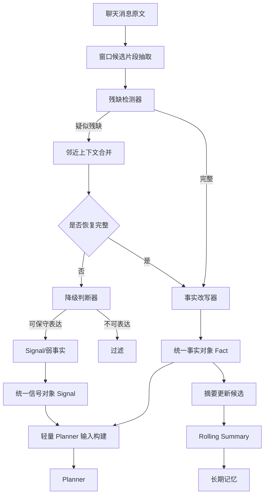

# SillyTavern 记忆插件残缺片段修复与轻量输入链实施方案

## 1. 文档定位

本文档用于指导你在 **SillyTavern-SS-Helper / memoryos-settings-unified** 方向上，为记忆插件落地一套**可直接实施**的“残缺片段修复 + 轻量 Planner 输入链”方案。

这份方案重点解决的问题是：

- 对话窗口抽取出来的 `windowFacts` 出现**半句、断句、截断对白、未闭合语义**；
- 这类残句如果直接送入 Planner，会污染推理输入，甚至进入长期记忆；
- 冷启动、阶段性 AI 总结、轻量输入构建之间缺少统一的“事实修复与降级策略”；
- 当前系统需要把“可补齐的片段”和“不能脑补的片段”清晰区分。

---

## 2. 目标

### 2.1 核心目标

1. **不把程序截断产生的残句直接送给 Planner**
2. **优先在本地完成受控补齐**
3. **补不齐时降级为 signal 或丢弃**
4. **整个链路对调试可见、对模型可约束、对后续记忆写入可追踪**
5. **与冷启动、摘要更新、长期记忆写回共用一套事实标准**

### 2.2 非目标

以下内容不在本次方案范围内：

- 不在本次版本内做复杂 NLP 句法解析器
- 不依赖外部向量数据库完成短句补全
- 不让模型自由续写残句
- 不在本地引入高成本全文检索服务
- 不把“剧情合理推测”当成“确定事实”

---

## 3. 一句话设计原则

> **先本地修结构，再保守改写成事实；修不稳就降级；绝不让模型自由脑补。**

---

## 4. 你当前系统中建议统一的三层记忆结构

你的记忆基础建议稳定为三大模块：

1. **Static Memory（静态基础记忆）**  
   冷启动得到的人物、背景、规则、身份、世界设定、基础关系。

2. **Rolling Summary（阶段性摘要记忆）**  
   每达到一定楼层后，对“尚未总结区间”执行增删改，得到阶段总结。

3. **Live Window Facts / Signals（实时窗口事实与信号）**  
   当前窗口内供 Planner 使用的轻量事实、事件信号、风险提示、未决事项。

这三个模块都应遵守同一个原则：

- 可进入长期层的内容，必须是**完整、保守、可追溯**的事实表达。
- 不完整但有价值的内容，只能以 **signal** 身份存在。
- 明显截断且无法恢复的片段，**直接过滤**。

---

## 5. 总体架构



---

## 6. 关键设计：把“事实”和“信号”彻底分开

这是整个方案里最重要的一步。

### 6.1 Fact 的定义

Fact 表示：

- 语义完整
- 主体明确
- 动作明确或状态明确
- 时间区间足够清楚
- 不依赖猜测
- 可以给 Planner 作为强输入
- 可以进入阶段摘要候选

例如：

- 艾莉卡要求毅毅按时赴约，否则交易作废且定金不退。
- 毅毅返回门口后，双方继续交涉。
- 当前交易尚未正式完成，仍处于接触阶段。

### 6.2 Signal 的定义

Signal 表示：

- 信息不够完整
- 但能表达一种状态、趋势、风险、未决事项
- 只能作为弱提示，不应直接写入长期记忆

例如：

- 双方接触仍在继续。
- 门口对话尚未结束。
- 当前存在未完成的委托交涉。

### 6.3 必须过滤的内容

以下直接丢弃：

- 纯残句且无法还原
- 代词链断裂导致主体不明
- 只有动作连接词，没有可还原主干
- 引号截半且上下文无法补
- 语义含混到会导致误写长期记忆

例如：

- “在门口进行……”
- “然后她又……”
- “他说如果不……”
- “我回去收拾了衣服，在……”

---

## 7. 在代码职责层上的模块拆分

这里不强依赖你当前分支的精确文件路径，按“职责”拆分即可映射到实际代码。

建议新增或明确以下职责模块：

### 7.1 `windowCandidateExtractor`
负责从最近窗口消息中提取候选片段：

- 原始对白
- 叙述句
- 行动描写
- 明确规则句
- 时间推进句
- 关系变化句
- 状态变化句

输出：

```ts
type WindowCandidate = {
  candidateId: string
  messageId: string
  turnIndex: number
  speaker?: string
  rawText: string
  normalizedText: string
  sourceRange?: [number, number]
  candidateType: 'dialogue' | 'narration' | 'action' | 'rule' | 'state' | 'event'
}
```

### 7.2 `fragmentDetector`
负责检测候选是否为残缺片段。

### 7.3 `contextRepairEngine`
负责从邻近上下文恢复句子完整性。

### 7.4 `factRewriter`
负责把恢复后的文本改写为保守事实句。

### 7.5 `signalDowngrader`
负责把不能作为 Fact 的片段降级为 Signal。

### 7.6 `plannerInputAssembler`
负责构建最终的轻量 Planner 输入：

- static memory 摘要
- rolling digest
- repaired facts
- signals
- unresolved threads

### 7.7 `memoryAuditLogger`
记录：

- 原文
- 修复方式
- 置信度
- 是否进入 Planner
- 是否进入摘要候选
- 是否被过滤

---

## 8. 残缺片段的分类

建议把残缺片段分成四类处理。

### A 类：句尾截断

特征：

- 末尾是逗号、顿号、破折号、冒号
- 出现“然后、继续、在……进行、准备去……”等未闭合结构
- 明显缺宾语或补语

例子：

- 毅毅过去了，我回去收拾了衣服，在门口进行……
- 她说如果迟到的话，交易就……

处理：

- 优先合并相邻句
- 恢复后重写为 Fact
- 恢复失败则降级或过滤

### B 类：对白截半

特征：

- 引号不闭合
- 句中断在规则、命令、威胁、约定上
- 引号内容是事实核心

例子：

- “要是你迟到交易作废，钱不……
- “你最好别让我失……

处理：

- 用同轮/相邻轮消息合并
- 改写成叙述型 Fact
- 恢复不了则过滤，不允许硬猜

### C 类：主语链断裂

特征：

- 满是“他、她、她们、那边、这个人”
- 缺少前文绑定就无法确定是谁

处理：

- 优先回看同一 turn 与上一 turn
- 如果能绑定实体，进入改写
- 绑定不了，降级 signal 或过滤

### D 类：多句切坏后只剩中段

特征：

- 既无清晰开头，也无清晰结尾
- 像从一句中间切下来

处理：

- 优先视为低置信度候选
- 不要直接送给 Planner
- 仅在可稳定表达抽象状态时降级为 signal

---

## 9. 事实修复链的完整处理流程

## 9.1 第一步：预清洗

对候选文本做轻量归一化：

- 去掉重复空白
- 统一省略号
- 统一全角/半角标点
- 去掉明显无意义的包裹符号
- 保留原始文本，不直接覆盖

```ts
type NormalizedCandidate = WindowCandidate & {
  cleanedText: string
}
```

## 9.2 第二步：残缺检测

给每个候选做 `fragmentScore`。

### 检测规则建议

#### 规则 1：尾部未闭合标点
- 结尾为 `，、：——（「『“`
- 引号不闭合

#### 规则 2：尾部连接词/介词悬空
- 以 “然后 / 继续 / 在 / 向 / 为了 / 如果 / 于是 / 并且 / 准备” 之类结构结尾
- 以“在门口进行”“继续说明”“准备处理”等未闭合短语结尾

#### 规则 3：谓词不完整
- 有主语但动作结构只到一半
- 有动作但明显缺宾语或结果

#### 规则 4：长度异常
- 过短且只含连接结构
- 过长但句尾突断

#### 规则 5：引语结构异常
- 出现开引号无闭引号
- 引语中出现明显未结束条件句

### 建议输出

```ts
type FragmentAnalysis = {
  isFragment: boolean
  fragmentScore: number
  reasons: string[]
  fragmentType?: 'tail_cut' | 'dialogue_cut' | 'subject_broken' | 'mid_slice'
}
```

推荐阈值：

- `fragmentScore >= 0.7`：强疑似残句，禁止直送 Planner
- `0.4 <= fragmentScore < 0.7`：可尝试修复
- `< 0.4`：视为基本完整，但仍需事实改写

---

## 10. 邻近上下文补齐策略

## 10.1 补齐原则

只能做 **结构恢复**，不能做 **剧情推断**。

允许补的：

- 同一句缺失的后半段
- 同一事件中的动作对象
- 同轮相邻句中的结果补足
- 对白改写成叙述句时需要的主语绑定

不允许补的：

- 角色心理
- 未明说的决策
- 未来后果
- 情感升温/关系变化的主观解释
- 从语气推断为长期事实

---

## 10.2 邻近上下文查找范围

建议分三级：

### 一级：同一消息内部前后句
优先级最高，最安全。

### 二级：同一 turn 的相邻消息
比如用户和角色在同一轮里形成一个完整动作。

### 三级：上一 turn / 下一 turn 的局部句段
只用于补主体、补宾语、补事件名称，不用于扩展剧情。

建议窗口：

- 前后各 1~2 条消息
- 每条消息只提取局部句段，不把整段全拼上

---

## 10.3 补齐算法建议

```ts
type RepairContext = {
  prevSegments: string[]
  nextSegments: string[]
  sameTurnSegments: string[]
}
```

修复流程：

1. 尝试在同消息中找被切开的前后半句
2. 找同 turn 邻近句是否能闭合条件句/动作句
3. 若是对白截断，寻找最近一条同说话人延续句
4. 拼接后再跑一次 `fragmentDetector`
5. 如果仍残缺，不进入 Fact

---

## 10.4 修复结果对象

```ts
type RepairedCandidate = {
  candidateId: string
  originalText: string
  repairedText: string
  repairMode: 'none' | 'neighbor_merge' | 'same_turn_merge' | 'fact_rewrite' | 'signal_downgrade' | 'filtered'
  confidence: number
  fragmentType?: 'tail_cut' | 'dialogue_cut' | 'subject_broken' | 'mid_slice'
  sourceRefs: Array<{
    messageId: string
    excerpt: string
  }>
}
```

---

## 11. 事实改写器设计

修复完成之后，不要直接把“修复句”送入 Planner，而是统一改写成 **事实表达**。

## 11.1 改写目标

把句子改写成：

- 谁
- 做了什么
- 条件/规则是什么
- 当前状态如何
- 是否完成/未完成

## 11.2 推荐事实模板

### 模板 1：规则类
`{角色}规定/要求：{条件}，否则{结果}`

例：
- 艾莉卡要求毅毅按时赴约，否则交易作废且定金不退。

### 模板 2：行为延续类
`{角色/双方}在{地点/场景}继续{动作}`

例：
- 毅毅返回门口后，双方继续交涉。

### 模板 3：状态类
`当前{事项}仍处于{状态}`

例：
- 当前交易仍处于接触阶段，尚未正式完成。

### 模板 4：未决事项类
`{事项}尚未解决，当前关键点为{内容}`

---

## 11.3 事实改写的硬约束

改写时必须遵守：

1. 不新增原文没有明确支持的结论
2. 不补出明确心理活动
3. 不把威胁语气自动升级为最终决定
4. 不把“可能继续”改成“已经完成”
5. 不把一次对话推断成长期关系变化

---

## 12. Signal 降级策略

当文本有信息价值，但不够成为 Fact 时，统一降级。

### 12.1 适用场景

- 句子动作不全，但能说明“事情还在继续”
- 主体不完全确定，但事件状态明确
- 不能写成强事实，但可给 Planner 作为弱提示

### 12.2 Signal 结构

```ts
type PlannerSignal = {
  signalId: string
  text: string
  category: 'ongoing_contact' | 'unfinished_task' | 'risk' | 'uncertain_relation' | 'uncertain_event'
  confidence: number
  derivedFrom: string[]
}
```

### 12.3 示例

原残句：

- “毅毅过去了，我回去收拾了衣服，在门口进行……”

可降级为：

- 双方在门口的接触仍在继续。
- 当前门口交涉尚未结束。

注意：  
这类 signal 可以进 Planner，但**默认不进长期记忆**。

---

## 13. 最终给 Planner 的轻量输入结构

你现在的轻量输入建议统一成下面这套格式。

```ts
type LightweightPlannerInput = {
  staticMemory: string[]
  rollingDigest: string[]
  windowFacts: PlannerFact[]
  signals: PlannerSignal[]
  unresolvedThreads: string[]
  constraints: string[]
  metadata: {
    sourceTurnRange: [number, number]
    droppedFragments: number
    repairedFragments: number
    downgradedSignals: number
  }
}
```

### 13.1 PlannerFact 结构

```ts
type PlannerFact = {
  factId: string
  text: string
  category: 'rule' | 'event' | 'state' | 'relationship' | 'task' | 'time'
  confidence: number
  repairMode: 'none' | 'neighbor_merge' | 'same_turn_merge' | 'fact_rewrite'
  originalText?: string
  sourceRefs: Array<{
    messageId: string
    excerpt: string
  }>
}
```

### 13.2 约束建议

`constraints` 至少包含：

- 不允许根据 signal 推导强事实
- 不允许根据残缺事实脑补剧情
- 对未决事项只允许生成保守计划
- 如果事实不足，优先维持现状而不是生成大幅推进动作

---

## 14. 冷启动与残缺修复的关系

你前面已经规划过冷启动，这里需要明确：  
**冷启动本身不做“残句修复”主流程，但需要输出同样结构的 Fact。**

## 14.1 冷启动阶段职责

通过 `sharedDialog` 弹窗选择：

- 当前角色卡关联世界书
- 允许纳入冷启动的条目
- 规则型条目
- 背景型条目
- 人设型条目
- 约束型条目

冷启动输出应直接进入：

- `staticMemory`

### 冷启动结果必须遵守

- 只产出结构完整的 Fact
- 不产出 Signal
- 不产出含糊关系结论
- 规则条目优先改写为客观规则句

---

## 15. 阶段性 AI 总结与残缺修复的关系

AI 总结不应再处理原始残句，而应该只处理：

- 已经通过修复器的 Fact
- 经过降级的 Signal（可选）
- 以及窗口内原始消息中尚未被吸收的完整事件

## 15.1 建议链路


### 关键点

> 摘要器看到的应该是“修复后的事实层”，而不是“原始半句层”。

这样做的收益：

- 降低摘要被半句污染
- 降低后续长期记忆错写
- 提高摘要的增删改稳定性

---

## 16. AI 总结 JSON 协议建议

你之前已经考虑过“让 AI 用指定 JSON 做增删改”，这里建议直接上结构化协议。

```json
{
  "add": [
    {
      "id": "summary_fact_001",
      "text": "艾莉卡要求毅毅按时赴约，否则交易作废且定金不退。",
      "category": "rule",
      "confidence": 0.91
    }
  ],
  "update": [
    {
      "id": "summary_fact_010",
      "text": "当前交易仍处于接触阶段，尚未正式进入执行。",
      "reason": "window facts indicate negotiation is still ongoing"
    }
  ],
  "remove": [
    {
      "id": "summary_fact_003",
      "reason": "obsolete or contradicted by newer confirmed facts"
    }
  ],
  "carrySignals": [
    {
      "text": "门口接触仍在继续。",
      "category": "ongoing_contact",
      "confidence": 0.55
    }
  ]
}
```

### 强约束

- `add/update` 只能基于 Fact
- Signal 不允许直接写入长期摘要正文
- Signal 只能作为观察项保留，下一轮若获得事实支持，才升级为 Fact

---

## 17. 对 Planner 的系统约束建议

把这部分写进 Planner 的系统提示或固定策略中。

### 17.1 Planner 必须知道的规则

1. `windowFacts` 为当前最可信的近期事实
2. `signals` 仅为弱提示，不可升级为确定结论
3. 若事实不足，优先给出保守计划
4. 不可根据不完整对白脑补新事件
5. 不可把接触中自动解释为关系提升
6. 不可把威胁/警告自动解释为最终决裂
7. 若同一事项同时存在 Fact 与 Signal，以 Fact 为准

### 17.2 建议固定写法

```text
你收到的近期输入分为 facts 与 signals。
facts 为已确认且经过本地修复的事实。
signals 仅表示未完全确认的趋势或未决事项。
你不得将 signal 扩写为确定事件，不得为残缺片段补写原文未明确提供的结论。
若信息不足，应保持保守计划。
```

---

## 18. UI 与调试面板必须补上的可观测性

这个部分非常关键，不然你后面会很难调。

## 18.1 建议调试面板显示字段

每条候选至少显示：

- 原文片段
- 检测结果
- 残缺类型
- 修复方式
- 修复后文本
- 置信度
- 最终归类（Fact / Signal / Filtered）
- 是否进入 Planner
- 是否进入摘要候选

### 示例面板数据

```ts
type MemoryRepairDebugRow = {
  originalText: string
  fragmentScore: number
  fragmentType?: string
  repairMode: string
  repairedText?: string
  finalKind: 'fact' | 'signal' | 'filtered'
  confidence: number
  enteredPlanner: boolean
  enteredSummaryCandidate: boolean
}
```

## 18.2 建议颜色

- 绿色：原生完整 Fact
- 蓝色：修复后 Fact
- 黄色：Signal
- 红色：Filtered

---

## 19. 推荐实施顺序

不要一上来全改，建议四阶段推进。

## 第一阶段：先把危险残句拦住

目标：

- 所有强疑似残句不再直接进入 Planner

实施：

- 加 `fragmentDetector`
- 加 `fragmentScore`
- 大于阈值直接阻断

验收：

- 不再出现明显半句送入 Planner

## 第二阶段：实现邻近合并修复

目标：

- 让常见句尾截断、对白截半得到可控恢复

实施：

- 同消息 / 同 turn / 邻近 turn 合并
- 合并后重跑检测
- 成功则进入 Fact 改写

验收：

- 常见残句可恢复为完整客观句

## 第三阶段：引入 Signal 降级

目标：

- 不再只有“修好 / 丢弃”两种结果

实施：

- 加 `signalDowngrader`
- Planner 接收 `signals`

验收：

- 模型获得更多弱上下文，但不污染长期事实

## 第四阶段：打通摘要层与调试层

目标：

- 修复链路进入滚动摘要候选
- 面板可视化所有修复行为

实施：

- 摘要只吃 Fact
- Signal 单独保留
- 调试日志可追踪

验收：

- 出错时能定位是抽取错、修复错、改写错还是摘要错

---

## 20. 推荐函数边界

下面给一套建议函数边界，你可以直接映射到现有代码。

```ts
function extractWindowCandidates(messages: ChatMessage[]): WindowCandidate[]

function analyzeFragment(candidate: WindowCandidate): FragmentAnalysis

function buildRepairContext(
  candidate: WindowCandidate,
  messages: ChatMessage[],
): RepairContext

function repairFragment(
  candidate: WindowCandidate,
  ctx: RepairContext,
): RepairedCandidate

function rewriteAsFact(
  repaired: RepairedCandidate,
): PlannerFact | null

function downgradeToSignal(
  repaired: RepairedCandidate,
): PlannerSignal | null

function assembleLightweightPlannerInput(params: {
  staticMemory: string[]
  rollingDigest: string[]
  recentMessages: ChatMessage[]
}): LightweightPlannerInput
```

---

## 21. 关键伪代码

## 21.1 主流程

```ts
function assembleLightweightPlannerInput(params): LightweightPlannerInput {
  const candidates = extractWindowCandidates(params.recentMessages)

  const facts: PlannerFact[] = []
  const signals: PlannerSignal[] = []
  let droppedFragments = 0
  let repairedFragments = 0
  let downgradedSignals = 0

  for (const candidate of candidates) {
    const analysis = analyzeFragment(candidate)

    if (!analysis.isFragment) {
      const directFact = rewriteAsFact({
        candidateId: candidate.candidateId,
        originalText: candidate.rawText,
        repairedText: candidate.normalizedText,
        repairMode: 'none',
        confidence: 0.9,
        sourceRefs: [{ messageId: candidate.messageId, excerpt: candidate.rawText }],
      })
      if (directFact) facts.push(directFact)
      continue
    }

    const ctx = buildRepairContext(candidate, params.recentMessages)
    const repaired = repairFragment(candidate, ctx)

    if (
      repaired.repairMode === 'neighbor_merge' ||
      repaired.repairMode === 'same_turn_merge' ||
      repaired.repairMode === 'fact_rewrite'
    ) {
      const fact = rewriteAsFact(repaired)
      if (fact) {
        facts.push(fact)
        repairedFragments++
        continue
      }
    }

    const signal = downgradeToSignal(repaired)
    if (signal) {
      signals.push(signal)
      downgradedSignals++
      continue
    }

    droppedFragments++
  }

  return {
    staticMemory: params.staticMemory,
    rollingDigest: params.rollingDigest,
    windowFacts: dedupeFacts(facts),
    signals: dedupeSignals(signals),
    unresolvedThreads: buildUnresolvedThreads(facts, signals),
    constraints: [
      'signals are not confirmed facts',
      'do not infer unstated conclusions from incomplete fragments',
      'prefer conservative planning when evidence is insufficient',
    ],
    metadata: {
      sourceTurnRange: getTurnRange(params.recentMessages),
      droppedFragments,
      repairedFragments,
      downgradedSignals,
    },
  }
}
```

---

## 21.2 残缺检测器

```ts
function analyzeFragment(candidate: WindowCandidate): FragmentAnalysis {
  const text = candidate.normalizedText.trim()
  const reasons: string[] = []
  let score = 0

  if (/[，、：—\-（「『“]$/.test(text)) {
    score += 0.35
    reasons.push('tail_open_punctuation')
  }

  if (hasUnclosedQuote(text)) {
    score += 0.35
    reasons.push('unclosed_quote')
  }

  if (endsWithDanglingConnector(text)) {
    score += 0.2
    reasons.push('dangling_connector')
  }

  if (looksLikeIncompletePredicate(text)) {
    score += 0.25
    reasons.push('incomplete_predicate')
  }

  if (looksLikeMidSlice(text)) {
    score += 0.25
    reasons.push('mid_slice')
  }

  const isFragment = score >= 0.4
  return {
    isFragment,
    fragmentScore: Math.min(score, 1),
    reasons,
    fragmentType: inferFragmentType(reasons),
  }
}
```

---

## 21.3 邻近修复

```ts
function repairFragment(candidate: WindowCandidate, ctx: RepairContext): RepairedCandidate {
  const original = candidate.normalizedText

  const merged1 = tryMergeWithinSameMessage(original, ctx.sameTurnSegments)
  if (merged1 && !analyzeTextOnly(merged1).isFragment) {
    return {
      candidateId: candidate.candidateId,
      originalText: candidate.rawText,
      repairedText: merged1,
      repairMode: 'same_turn_merge',
      confidence: 0.85,
      sourceRefs: collectRefs(ctx),
    }
  }

  const merged2 = tryMergeWithNeighbors(original, ctx.prevSegments, ctx.nextSegments)
  if (merged2 && !analyzeTextOnly(merged2).isFragment) {
    return {
      candidateId: candidate.candidateId,
      originalText: candidate.rawText,
      repairedText: merged2,
      repairMode: 'neighbor_merge',
      confidence: 0.75,
      sourceRefs: collectRefs(ctx),
    }
  }

  return {
    candidateId: candidate.candidateId,
    originalText: candidate.rawText,
    repairedText: original,
    repairMode: 'signal_downgrade',
    confidence: 0.45,
    sourceRefs: collectRefs(ctx),
  }
}
```

---

## 22. 典型案例：你刚刚提到的这类残句

原文候选：

> “毅毅过去了，我回去收拾了衣服，在门口进行……”

### 情况 A：上下文能确认是在继续交涉

最终 Fact：

- 毅毅返回门口后，双方继续交涉。

### 情况 B：只能确认双方仍有接触，不能确认具体行为

最终 Signal：

- 双方在门口的接触仍在继续。

### 情况 C：连是否继续交涉都不确定

最终处理：

- Filtered

---

## 23. 数据去重策略

必须去重，否则修复后的句子和原生句子会重复进入 Planner。

### 去重建议

优先组合以下条件：

- 主体
- 事件核心动词
- 关键对象
- 时间位置
- 规则结果

可用简单指纹：

```ts
fingerprint = normalize(subject + action + object + state + condition)
```

### 去重规则

- 高置信度 Fact 覆盖低置信度同义 Fact
- Fact 覆盖同主题 Signal
- 新事实更新旧事实时，旧事实进入 obsolete 标记，不立即物理删除，便于调试

---

## 24. 长期记忆写入规则

为了避免污染，给长期层加硬门槛。

### 允许写入长期层的内容

- 冷启动静态事实
- 高置信度阶段摘要事实
- 连续两轮以上被支持的稳定事实
- 明确规则、身份、设定、长期关系状态

### 默认不写入长期层的内容

- Signal
- 单轮不稳定事件
- 残句修复但置信度偏低的临时事实
- 只在当前局部成立的短时动作

---

## 25. 质量验收标准

你可以把下面这些当成验收 checklist。

## 25.1 功能验收

1. 明显半句不会再直接进入 Planner
2. 常见句尾截断能修复为完整事实
3. 无法修复的片段能降级为 signal 或过滤
4. 摘要层不会再吸收大量半句
5. 调试面板可以看到每一步处理结果

## 25.2 质量指标

建议记录：

- 残句拦截率
- 修复成功率
- Signal 降级率
- 误修率
- 长期记忆污染率
- Planner 因输入残缺导致的错误计划率

推荐最初目标：

- 明显残句拦截率 >= 95%
- 修复后进入 Fact 的误修率 <= 5%
- Signal 被错误升级为长期事实的比例接近 0

---

## 26. 建议开发顺序拆分为具体任务

## Task 1：定义统一类型
- 定义 `WindowCandidate`
- 定义 `FragmentAnalysis`
- 定义 `RepairedCandidate`
- 定义 `PlannerFact`
- 定义 `PlannerSignal`
- 定义 `LightweightPlannerInput`

## Task 2：实现残缺检测器
- 标点未闭合检测
- 引号未闭合检测
- 悬空连接词检测
- 不完整谓词检测
- 中段切片检测

## Task 3：实现邻近修复器
- 同消息片段合并
- 同 turn 合并
- 邻近 turn 合并
- 合并后二次检测

## Task 4：实现事实改写器
- 规则类模板
- 行为延续类模板
- 状态类模板
- 未决事项类模板

## Task 5：实现 signal 降级器
- ongoing_contact
- unfinished_task
- risk
- uncertain_event

## Task 6：替换现有轻量输入构建
- 在 `buildLightweightPlannerInput` 等职责点接入新链路
- 原生残句禁止直通

## Task 7：接入摘要层
- 摘要只读取 Fact
- Signal 只做旁路观察

## Task 8：做调试面板
- 每条候选可展开查看原文、修复方式、最终去向

---

## 27. 风险与对应策略

### 风险 1：修复过度，变成脑补
策略：
- 限制只用局部邻近句
- 修复后必须再次过残缺检测
- 必须经过事实模板重写
- 低置信度优先降级 signal

### 风险 2：过于保守，丢掉太多信息
策略：
- 引入 signal 层，不只剩“保留/丢弃”
- 对规则句和任务句优先修复

### 风险 3：性能开销过大
策略：
- 仅处理近期窗口
- 邻近上下文限制为前后 1~2 条
- 不做复杂 NLP，只做规则型修复

### 风险 4：摘要与实时层标准不一致
策略：
- 摘要只吃 Fact
- Fact/Signal 类型统一
- 所有层共用同一套审计记录

---

## 28. 最终建议结论

如果你想把这套记忆插件做稳定，**残缺片段修复绝对不能只是一个 if 判断补补字符串**。  
它必须是一个完整的小链路：

1. **先抽候选**
2. **判定是否残缺**
3. **用邻近上下文做受控补齐**
4. **补齐后改写为事实**
5. **不能成事实就降级 signal**
6. **再统一送入 Planner**
7. **摘要层只吃 Fact**
8. **全过程可审计、可调试、可回溯**

这样你后面不管是接冷启动、阶段总结、长期记忆写入，还是做 UI 面板和调试，都不会乱。

---

## 29. 我给你的直接落地建议

如果你现在马上开工，最优先做这四件事：

### 第一件
在当前轻量输入构建入口前，加一个 **fragmentDetector**，先把危险半句全部拦住。

### 第二件
实现 **neighbor_merge + fact_rewrite** 两步，让最常见的截断句能恢复。

### 第三件
补上 **signal 层**，别让系统只能“修好”或“丢弃”。

### 第四件
做一个 **repair debug panel**，不然你后面会很难知道到底哪一步出了错。

---

## 30. 版本建议

### V1
- 残句检测
- 危险拦截
- 基础邻近修复
- Fact/Signal 分流

### V2
- 接摘要层
- 接调试面板
- 增加去重和 obsolete 标记

### V3
- 优化规则模板
- 针对不同角色卡/文风做特化
- 统计误修率与污染率

---

## 31. 结束语

这套方案的核心不是“让模型更聪明”，而是：

> **先把输入整理成模型不容易犯错的结构。**

你的系统只要先把“残句”“弱信号”“强事实”三者分清，后面的冷启动、摘要、长期记忆、Planner 规划都会稳很多。
